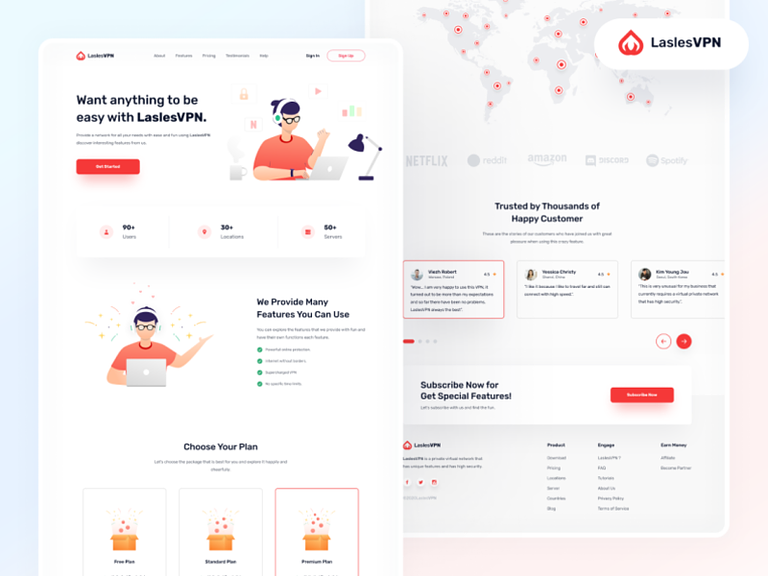

# Lasles VPN Landing Page

## 🌐 Live Demo

Experience the sleek design and functionality: [Lasles VPN Live](https://alirafatartist.github.io/100DaysOfCode/implementions/Lasles%20VPN)

## 🌓 Dark & Light Mode

Enjoy a personalized browsing experience with our seamless dark and light mode toggle. Switch between themes to suit your preference and reduce eye strain.

## 🚀 Features

- Responsive design for all devices
- Intuitive user interface
- Secure VPN services showcase
- Pricing plans comparison
- Customer testimonials
- Global server network display

## 🛠️ Built With

- HTML5
- CSS3
- JavaScript

## 📝 License

This project is open source and available under the [MIT License](LICENSE).

## 🤝 Contributing

Contributions, issues, and feature requests are welcome! Feel free to check the [issues page](../../issues).

## 👨‍💻 Author

**Ali Rafat**

- GitHub: [@AliRafatArtist](https://github.com/AliRafatArtist)
- Portfolio: [alirafatartist.github.io](https://alirafatartist.github.io/)

Give a ⭐️ if you like this project!
